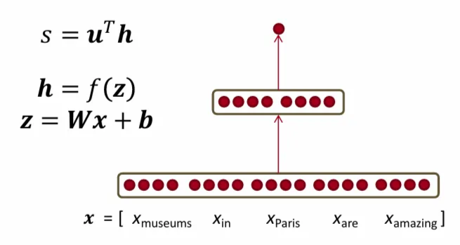
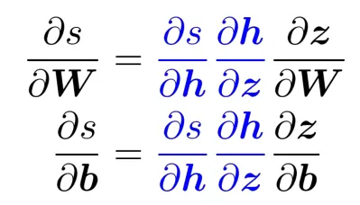
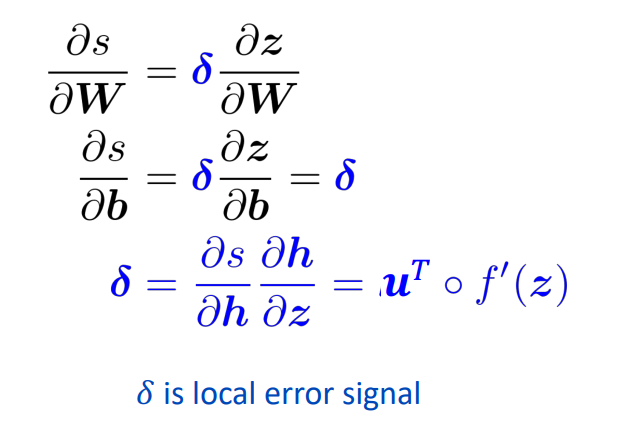
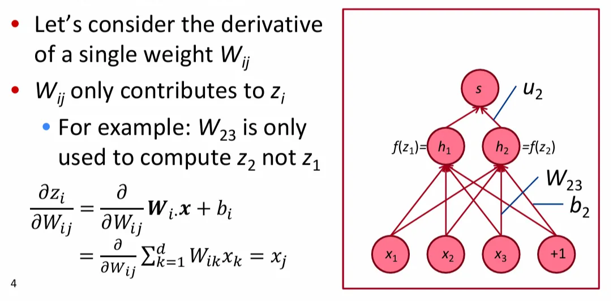
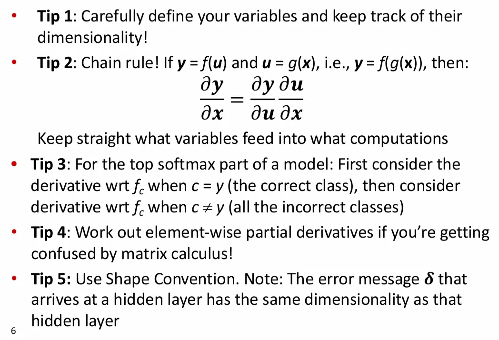
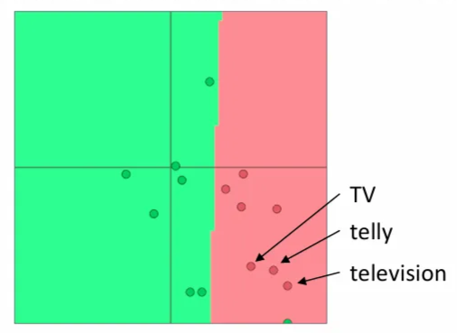
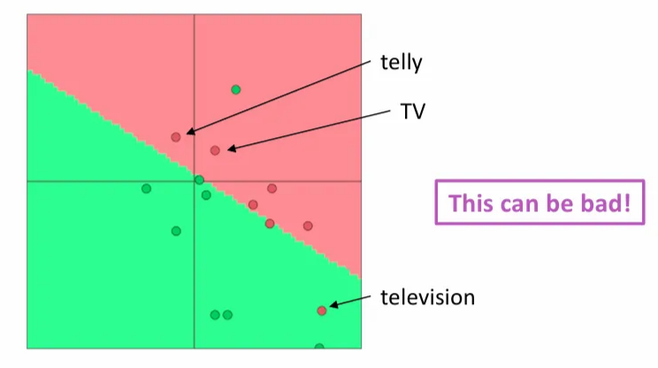
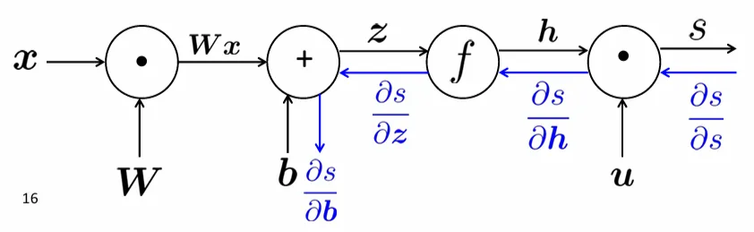
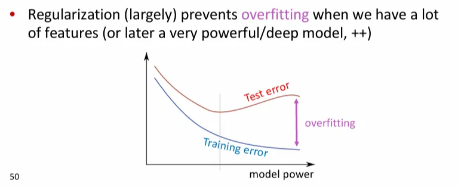
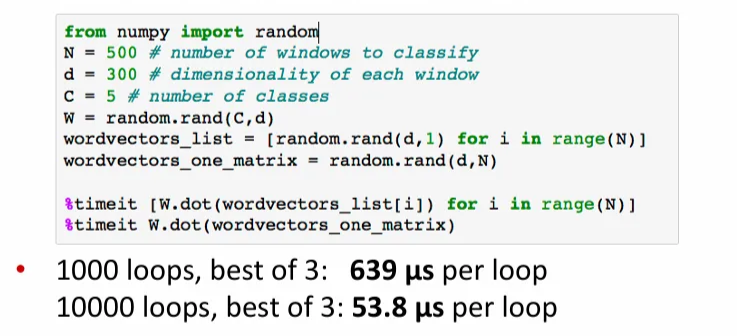

# Lecture04: Backpropagation and Computation Graphs

# 1. Matrix Gradients for NN

<aside>
💡

**NN의 과정**은 다음과 같다.

- **feed forward**: $W\times x$ = output vector = predict 값
- **backpropagation**: output vector를 가중치 행렬 $W$에 대해 미분
</aside>

모델의 계산 식 설명:

- 5개의 단어(museums, in, Paris, are, amazing)로 구성된 window $x$
- $z=Wx+b$
- $h=f(z)$의 비선형성은 신경망 레이어 $f$를 통해 입력한다.
- $s=u^Th$ 는 center에 실체의 이름(like Paris) 존재 여부에 대한 점수로, hidden layer와 내적을 취해 구한다.

### Chain Rule

 NN은 Chain Rule을 이용해 최종 스칼라 값 $s$를 가중치 행렬 $W$로 미분해 나가며 가중치를 업데이트 하는 방식으로 학습을 진행한다.

## 1) 역전파를 위한 그래디언트(gradient) 유도

<aside>
💡

 지난 강의에서 처음 두 개의 편도 함수가 무엇인지 계산했으며 $\partial s \over \partial W$와 $\partial s \over \partial b$의 중복된 연산을 피하기 위해 해당 부분(파란색)의 연산을 **local error signal** $\delta$로 묶어서 정의했다.

 (이 개념은 강의의 중심 개념에서 다시 설명함)

</aside>

 Lecture04에서는

$$
{\partial s \over \partial W}={\partial s \over \partial h}{\partial h \over \partial z}{\partial z \over \partial W}=\delta {\partial z \over \partial W}=\delta{\partial \over \partial W}Wx + b
$$

에서 다루지 않은 부분인 $\partial z \over \partial W$을 계산한다.

 $\delta {\partial z \over \partial W}=\delta{\partial \over \partial W}Wx + b$ 이고, $W$는 행렬이다. 행렬의 요소인 단일 가중치($W_{ij}$)로 계산 작업을 수행한 뒤 전체 행렬에서 다시 생각하는 방법을 사용한다.  

 [사진] 입력($x_1,~x_2,~x_3$)과 편향 항($+1$)이 있고, 가중치 행렬 $W$에 이 벡터를 곱해서 hidden layer $h$를 생성한다.

 예를 들어, 특정 가중치 $W_{23}$에 대해 첫 번째 인덱스 $2$는 hidden layer $h_2$에 해당하고, 두 번째 인덱스 $3$은 입력 벡터 $x_3$에 해당한다. 결국 행렬의 한 가중치는 hidden layer의 한 요소를 계산하는 것이 된다.

$$
\frac{\partial z_i}{\partial W_{ij}}=\frac{\partial}{\partial W_{ij}}W_ix+b_i=\frac{\partial}{\partial W_{ij}}\sum^{d}_{k=1}W_{ik}x_k=x_j
$$

 즉, $\frac{\partial}{\partial W_{ij}}\sum^{d}_{k=1}W_{ik}x_k=x_j$에서 $k==j$(hidden layer의 위치)인 경우만 단일 가중치 $W_{ij}$가 사용되기 때문에 결과는 ****$x_j$만 남는다.

---

 단일 요소에 대한 결과로 **local gradient signal** $x_j$를 구했다. 이제 전체 가중치 행렬 $W$에 대한 자코비안 행렬을 구하고자 한다.

 앞선 내용에 따라 단일 $W_{ij}$에 대한 $s$의 미분은 $\delta_i x_j$ 이고, 이는 행렬의 모든 셀에 해당된다.

$$
{\partial s \over \partial W_{ij}}=\delta_i x_j
$$

 이를 모든 $W$의 요소에 적용하기 위해 전체 가중치에 대한 $\delta^T$와 $x^T$를 구한 후, 외적(outer product)을 계산한다. 결과적으로 error signal과 local gradient signal을 곱한 형태를 얻는다.

---

### Deriving Gradients: TIPs

1. 변수를 잘 정의하고 차원을 계속 따라갈 것
2. Chain Rule! 계산에 사용되는 변수를 따라갈 것
3. 모델 마지막의 softmax 값에 대해서 정답 클래스와 오답 클래스에 대해 따로 미분하여 계산할 것
4. 행렬 미분 방법이 헷갈리면 element-wise 부분의 미분을 연습할 것
5. Shape Convention을 이용할 것 (hidden layer에 도착한 error message $\delta$ 는 hidden layer와 차원이 같음)

---

## 2) window 모델의 단어 벡터에 대한 그래디언트

 우리는 window 단위의 단어 벡터 행렬을 정의한다. 이 행렬 자체가 아닌 $\delta_{window}$를 clasifier에 연결한다. 사진의 예제에서 window에는 5개의 단어가 포함된다.

- 이 경우 $\delta_{window}$는 $5d$(5차원) 벡터

 이 window 벡터를 5개로 나누고 계산된 gradient를 통해 각각 업데이트한다. 같은 단어가 두 번 이상 나타나는 경우, 해당 window에서 두 업데이트를 모두 적용한다.

 신경망을 통해 단어 벡터를 업데이트하면서 주변 단어를 통한 NER(Named Entity Recognition, 문장 단어의 이름을 찾고 구분하는 작업)을 수행할 수 있다. 예를 들어 in이라는 단어($x_{in}$)가 center 단어 바로 앞에 위치할 경우, center 단어가 위치를 나타내는 named entity(ex. London, Paris)라는 것을 알 수 있다.

 이런 식으로 classifier가 잘 작동하는 방향으로(명명된 개체 인식 분류와 같은 작업을 잘 수행하는 방향으로) 단어 벡터가 업데이트 된다.

## 3) 단어 벡터를 다시 학습시킬 때의 위험 요소

- **설정**: 단일 단어를 사용한 영화 리뷰의 감정 분류를 수행하는 로지스틱 회귀 분류 모델을 학습시키는 상황
- **학습 데이터**: TV, telly
- **테스트 데이터**: television
- TV, telly, television은 같은 것을 의미하기 때문에 pre-trained 단어 벡터 공간에서 서로 가까이 위치한다. (유사한 의미)

> **Q. 단어 벡터를 업데이트할 때 어떠한 문제가 발생하는가?**
> 

> **A.**
> 
> - 학습 데이터에 있는 단어는 벡터 공간을 이동한다. (TV, telly)
> - 학습 데이터에 없는 단어는 이동하지 않고 원래 있던 자리에 머물러 있는다. (television)

 이는 학습 데이터에 있는 단어에만 gradient를 적용해 업데이트 하기 때문이다. 따라서 학습 데이터에 없는 단어는 이동하지 않고 자리에 머문다.

 실제로 테스트 시 모델을 실행할 때 television이 포함된 문장을 평가하면 잘못된 대답을 내놓을 수 있다. (다른 의미를 지닌 단어로 잘못 분류됨) 하지만 세 단어는 거의 같은 의미를 가지는 단어이므로 동일하게 취급해야 classifier가 더 나은 작업을 수행할 수 있다.

 이 경우 **pre-trained 모델**을 사용하면 된다.

---

> **Q.** **pre-trained 단어 벡터**를 사용해야 하는가?
**A.**
> 
> - word2vec과 같은 pre-trained 단어 벡터를 사용할 수 있다. 대규모의 데이터가 학습되어 있으므로 학습 데이터 셋 포함 유무에 관계 없이 거의 모든 단어에 대한 분류가 가능하다.
> - 알고리즘이 단순하고 텍스트 데이터만 있으면 만들 수 있으므로 사용이 편리하다.
> - 만약 데이터 양이 100만 개 이상인 정도로 대규모일 경우(ex. 대규모 한국어-영어 번역 문서), 랜덤 단어 벡터로 시작해서 모델을 학습해도 괜찮다.

 

> **Q. 단어 벡터를 fine-tuning** 해야 하는가?
**A.**
> 
> - **fine-tuning:** pre-trained 모델을 기반으로 모델의 구조를 목적 task에 맞게 변형하고 이미 학습된 가중치로부터 학습을 업데이트 하는 방법
> - 데이터 셋의 크기에 따라 다르다.
>     - 학습 데이터 세트가 작은 경우(수십 만 단어), 업데이트에서 누락되는 단어가 존재할 수 있기 때문에 pre-trained 단어 벡터를 고정하고 업데이트 하지 않는 것이 좋다.
>     - 학습 데이터 세트가 큰 경우(백 만 단어), 단어 벡터를 fine-tuning 하는 것이 좋다.
> - 실제로는 두 가지 방법을 모두 수행하고 성능이 더 좋은 것을 사용한다.

# 2. Computation Graphs and Backpropagation

 지금까지 역전파에 대해서 살펴 보았다. 역전파는 일반화된 chain rule을 사용하여 도함수를 취하는 것이다.

 이 과정에서 $\delta$로  표현되는 상위 레이어에서 계산된 도함수를 **재사용**하여 계산을 최소화할 수 있다. 이를 더욱 체계적으로 수행하는 방법을 알아보자.

## 1) 계산 그래프 (Computation Graph)

 계산 그래프를 통해 역전파 알고리즘을 실행할 수 있다.

### (1) 순반향 전파 (Forward Propagation)

 $Wx + b$에 비선형성 $f$를 적용한 뒤, $u$와 내적하는 것으로 Neural Network(NN)에서 사용되는 산술식을 그래프로 표현할 수 있다. 변수로 시작하여 계산을 수행하고 $s$가 무엇인지 계산하는 이 부분이  바로 순방향 전파이다.

 하지만 우리가 원하는 것은 학습 알고리즘이기 때문에 그 반대(역전파)도 수행해야 한다.

### (2) 역전파 (Backpropagation)

 $s$에서 시작해서 각 단계에서 편도 함수를 계산하고 그래프를 통해 뒤로 전달한다.

 $\partial s \over \partial z$까지 계산한 것은 local error signal이고, 이것을 뒤로 더 전달해서 gradient를 계산할 수 있다.

1. **단일 입력**의 단일 노드 역전파
    
     변수는 계산 노드의 출력이므로 역전파 과정에서 단일 노드는 upstream gradient $\partial s \over \partial h$를 받는다. 그런 다음, 노드에서 어떠한 작업(ex. 비선형성 $f$)을 수행한다.
    
     우리가 원하는 것은 downstream gradient $\partial s \over \partial z$이다. 그렇다면 문제는 이를 어떻게 수행하는가?
    

 chain rule을 사용해 계산할 수 있다. 우리는 local gradient라는 개념을 가지고 있다. $h$가 출력이고, $z$가 입력이다. 노드의 함수 $f$는 비선형성이고, 이 함수에 대한 local gradient는 $\partial h \over \partial z$이다.

 이렇게 local gradient와 upstream gradient를 가지고 있는 경우, ${\partial s \over \partial z}={\partial s \over \partial h}{\partial h \over \partial z}$를 이용해 downstream gradient를 구할 수 있다. 그러면 이 downstream gradient를 다시 다음 노드로 전달할 수 있다.

$$
downstream\_gradient = upstream\_gradient \times local\_gradient
$$

1. **다중 입력**의 단일 노드 역전파

 입력이 여러 개인 경우, 여러 개의 local gradient가 생성된다. 예를 들어, $x$에 대한 $z$의 편도 함수인 $\partial z \over \partial x$와  $x$에 대한 $z$의 편도 함수인 $\partial z \over \partial W$를 계산할 수 있다. 

 따라서 기본적으로 upstream gradient를 취하고 각 local gradient를 곱한 뒤 각각의 경로로 전달하여 다음 노드로 전달할 다양한 downstream gradient를 계산할 수 있다.

- Example
    
    
    
    1. **Forward Propagation**을 계산하기 위해 $x,~y,~z$ 값을 알아야 한다.
        
         예제에서는 $x=1,~y=2,~z=0$으로 값을 설정하여 순방향 계산에 적용한다.
        
    
    1. **Backpropagation**
        
        다음으로 역전파를 수행하여 gradient를 계산하기 위해 local gradient를 각각 계산한다. 
        
        - ${\partial a \over \partial x}=1,~{\partial a \over \partial y}=1$
        - max의 local gradient는 어떤 변수가 더 큰 지에 따라 달라진다. 더 큰 변수에 대한 편도 함수가 1
            
            ${\partial b \over \partial y}=1, {\partial b \over \partial z}=0$
            
        - ${\partial f \over \partial a}=b=2,~{\partial f \over \partial b}=a=3$
    
    
    
    1. 이제 최초 기울기 ${\partial f \over \partial f}=1$에서 시작해 **upstream gradient를 각각의 local gradient와 곱해 downstream gradient를 구하며** 나아간다.
        
        
        

## 2) Gradients Sum at Outward Branches

 여러 노드에서 한 노드로 순방향 전파가 일어나는 경우, 역전파 할 때에는 upstream gradient를 더해주면 된다.

## 3) 연산별 역전파의 특징 이해

- **더하기 연산($+$)**의 경우, upstream gradient가 그대로 downstream에 복사된다.
- **최댓값 연산($max$)**의 경우, 값이 큰 쪽으로만 gradient를 보내준다($1$). 이는 더 큰 변수에 대해서만 max 결과값이 영향을 받기 때문이다.
- **곱하기 연산($*$)**의 경우, 순방향 전파할 때 온 값을 서로 바꿔서 전달한다.

## 4) 역전파를 효율적으로

: 한번에 모든 gradient를 계산하는 효율적인 역전파 방법

1. 역전파를 수행하는 **잘못된** 방법
    
    : 모든 편도 함수를 계산한 뒤 chain rule을 이용해 곱하는 방법은 중복된 연산(파란색 화살표와 빨간색 화살표)을 필요로 하기 때문에 잘못된 방법이다.
    
2. **옳은** 방법
    
    : 위에서 오는 오류 신호의 공유되는 연산(초록색 화살표)이 존재한다. 이를 저장하면서 각 노드에 대한 upstream gradient를 순차적으로 계산한 뒤 노드의 local gradient를 곱하여 downstream gradient를 계산할 수 있다.
    

---

## +) Gradient의 2가지 계산 방법

1. **계산 그래프**를 사용한 역전파
    
    : ‘비순환적’ 계산 그래프를 통해  순방향과 역방향으로 chain rule 기반 연산을 수행할 수 있다. 구현을 올바르게 했다면, 순방향 전파와 역전파의 시간 복잡도가 같다.
    
    - 대부분의 실제로 사용되는 신경망은 해당 구조의 규칙적인 레이어를 가지고 있으며, 이것이 gradient를 벡터 행렬과 자코비 행렬의 관점에서 계산하는 것이 의미가 있는 이유이다.
    - 개별 노드에 대해 순방향/역방향 전파를 로컬 단계에서 수행하면 TensorFlow 또는 PyTorch가 나머지 모든 작업을 수행해 역전파 알고리즘을 실행한다.

1. **Numeric(수치적) Gradient**
    
    : 2014년 이전의 딥 러닝은 직접 gradient를 계산하여 가중치를 업데이트 했다. 구현하기 쉽고 정확하지만, 연산량이 매우 많기 때문에 느리다.
    
    $$
    f'(x) \approx {{f(x+h)-f(x-h)}\over 2h}
    $$
    
    - 미분과 유사하지만, $x$의 양 방향으로 아주 작은 $h$를 더하고 빼주는 것이 다른 점이다.
    - 이것이 의미하는 바는, 특정 가중치에 대한 미분이 잘 계산되었는지 알고 싶을 때 이 수치적 gradient 계산을 통해 확인할 수 있다는 것이다.

---

*지금까지 NN(Neural Network, 신경망)의 핵심 기술을 마스터했다!*

- **왜** gradient에 대한 디테일을 공부해야 하는가?
    
    
    
    
     현대의 딥 러닝 프레임워크는 gradient 계산을 전부 구현해 놓았기 때문에 이러한 메커니즘을 몰라도 동작한다.
    
     하지만 역전파는 언제나 완벽하게 동작하지만은 않는다. 따라서 **디버깅과 모델의 성능 향상을 위해** gradient 원리에 대해 알고 있어야 한다.
    
    - Gradient Exploding Problem, Gradient Vanishing Problem
    

# 3. Stuff you should know

*남은 시간은 딥 러닝을 하려고 한다면, 꼭 알아야 할 것들을 모아둔 시간이 될 것입니다!*

## 1) 정규화 (Regularization)

 **손실 함수(loss function)**에는 보통 정규화(regularization) 해주는 항이 존재한다. 정규화는 학습 데이터와 테스트 데이터 간의 차이로 인한 과적합(overfitting) 문제를 해결하기 위해 필요하다.

 **모델에 매개변수가 많으면** 해당 매개변수가 학습한 데이터의 내용을 기본적으로 기억할 수 있다. 이러한 특성으로 인해 답을 예측할 수 있는 것이다. 하지만 학습 데이터가 실제와 다르다면 문제가 발생한다. 그것이 바로 **과적합(overfitting)**이다.

 대표적인 정규화 기술에는 **L2 정규화**가 있다. 이는 ‘여기에서 매개변수를 0에서 멀리 이동시키는 만큼 페널티를 제공하겠습니다.’라고 말하는 것이다.

→ 매개변수가 많은 데이터 셋에 $\theta$에 대한 규제를 추가한다. *복잡한 모델에 페널티를 부여한다.*

## 2) 벡터화 (Vectorization)

 리스트 루프를 돌며 각 요소에 일일이 접근하는 연산보다 **numpy 등을 이용해 루프를 도는 행렬/벡터 기반의 연산**이 속도가 빠르다.

 딥 러닝에서 다루는 데이터는 매우 많기에 학습이 얼마나 빠르게 진행되는가도 중요하다.

## 3) 비선형성 (Nonlinearities)

<aside>
💡

 활성화 함수는 인공 신경망에서 **입력 신호를 다음 레이어에 어떻게 출력하느냐**를 결정하는 역할을 수행한다.

</aside>

 비선형성은 딥 러닝과 머신 러닝 알고리즘을 구분하는 딥 러닝의 필수 요소이다. 대표적인 비선형성 함수에는 다음과 같은 것들이 있다.

| Sigmoid | 어떤 숫자든 0~1 사이로 매핑한다. |
| --- | --- |
| tanh | Sigmoid와 유사하지만 -1 ~ 1 사이의 범위로 매핑한다. 대칭 구조의 출력(symmetric output)이기에 학습 시에 유리하다고 한다. |
| hard tanh | Sigmoid와 tanh의 exponential 계산이 연산 비용이 높기에 단순하게 flat한(hard한) tanh의 성능이 생각보다 잘 나왔다고 한다. |
| **ReLU** | 현대 딥 러닝에서 **디폴트로 쓰이는 비선형 활성화 함수**이다. hard tanh보다 더욱 간단하게 $x$가 0보다 크면 $x$를 그대로 반환하고, 작을 경우 0을 반환한다. gradient가 빠르게 전파된다는 장점이 있다. |
| Leaky ReLU, Parametric ReLU | $x$가 0보다 작을 때 조그마한 기울기를 주는 ReLU의 변형 버전 |

## 4) 초기화 (Initialization)

파라미터를 어떤 값으로 초기화하는지도 인공 신경망의 학습에 중요한 요소 중 하나이다. 

- 가중치 파라미터를 **작은 랜덤 값으로 초기화**하는 것이 중요하다. 가중치가 0인 상태에서 시작하면 모델이 완전한 대칭을 가지게 된다. 모든 것이 동일하게 계산되고 움직일 것이다. 어떻게든 이 대칭성을 없애기 위해 작음 임의의 가중치를 부여하여 수행해야 한다.
- hidden layer와 output layer의 bias는 0으로 초기화한다.
- 나머지 가중치들은 너무 크지도 작지도 않은 범위의 Uniform Distribution($Uniform(-r,r)$)에서 임의로 추출한다.

 Xavier Initialization이라는 기법도 많이 쓰이는데, 파라미터의 입력 개수와 출력 개수를 이용해 초기화 값의 범위를 정해주는 방식이다. 파라미터의 범위가 커지면 gradient 전파가 어려울 수 있으므로 파라미터가 많을 수록 표준편차가 작아지도록 초기화를 한다.

## 5) 최적화 (Optimizers)

 최적화 함수로는 **SGD**(Stochastic Gradient Descent, **확률적 경사 하강법**)를 보통 사용한다. 하지만 learning rate를 직접 설정해야 한다는 단점이 있다.

 복잡한 신경망일 때는 현재까지 계산된 gradient 값을 축적하며 이 정보에 따라 learning rate를 조절해주는 방식의 Adaptive 최적화 알고리즘을 사용하는 것이 좋다. 보통 파라미터 업데이트를 얼마나 했는지에 따라, 적게 했다면 learning rate를 키우고 많이 했다면 학습이 마무리되고 있다고 가정해 작은 learning rate로 사용한다.

- Adagrad, RMSprop, **Adam**, SparseAdam

## 6) 학습률 (Learning Rates, LR)

- 0.001 정도를 사용할 수 있다.
- 직접 정해줄 것이라면 **주로 10의 거듭제곱**을 사용한다.
- learning rate 값이 **너무 크면 모델이 발산**하거나 수렴(converge)하지 않을 수 있고, **너무 작으면 업데이트 양이 작아 학습이 느려진다.** 따라서 학습을 진행할수록 learning rate를 감소시키는 것이 성능 향상에 도움이 된다. (ex. 일정 epoch 마다 반 씩 줄여주는 식)
- 앞서 설명한 Adaptive 최적화 알고리즘도 learning rate를 사용하긴 하지만, 그 값을 계속해서 사용하는 것이 아니라 초기 값으로만 사용한다.